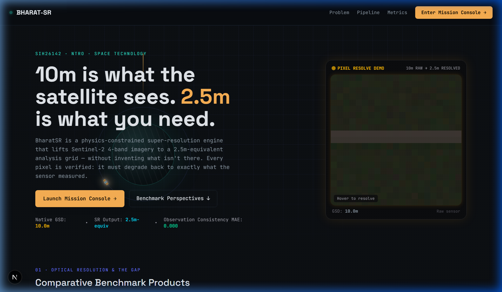
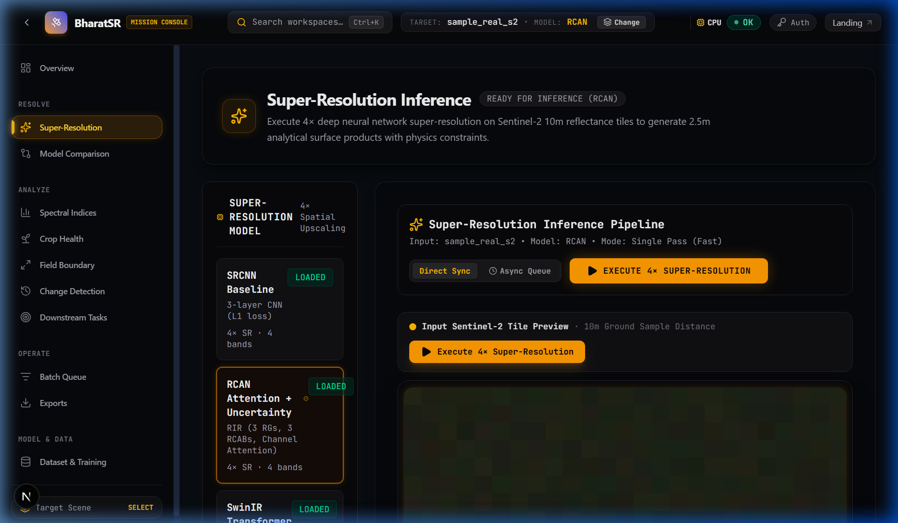
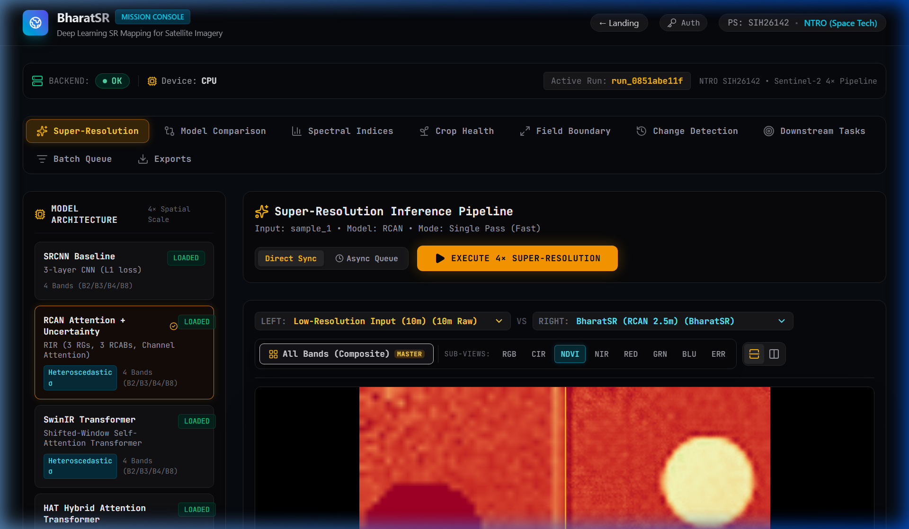
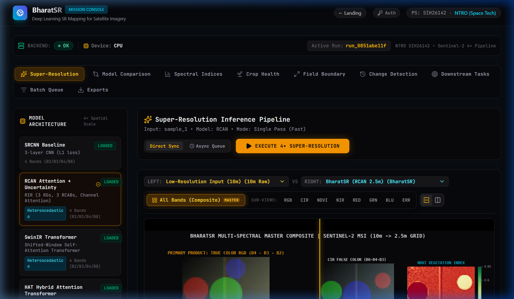
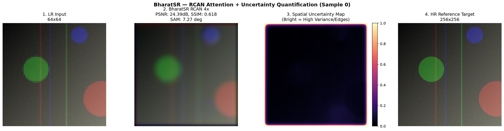
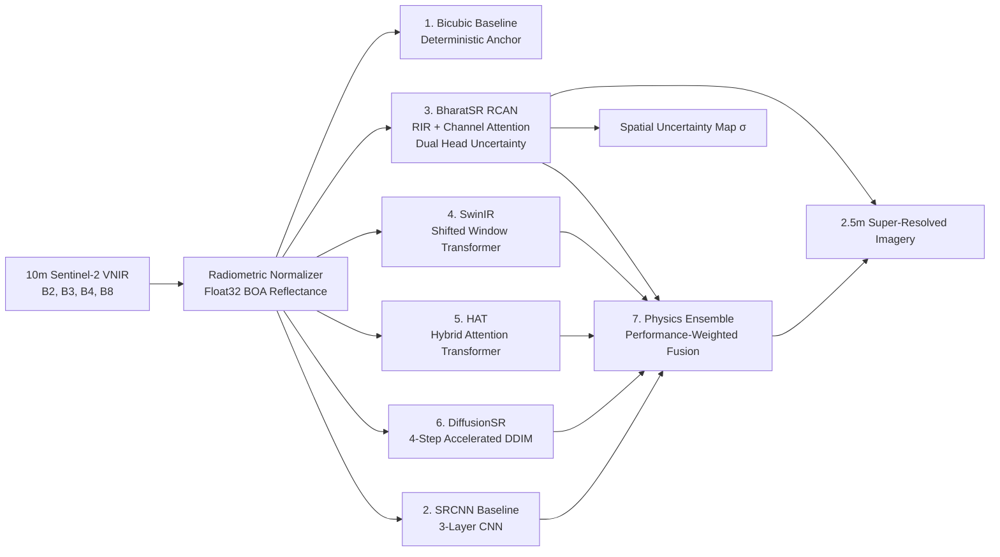
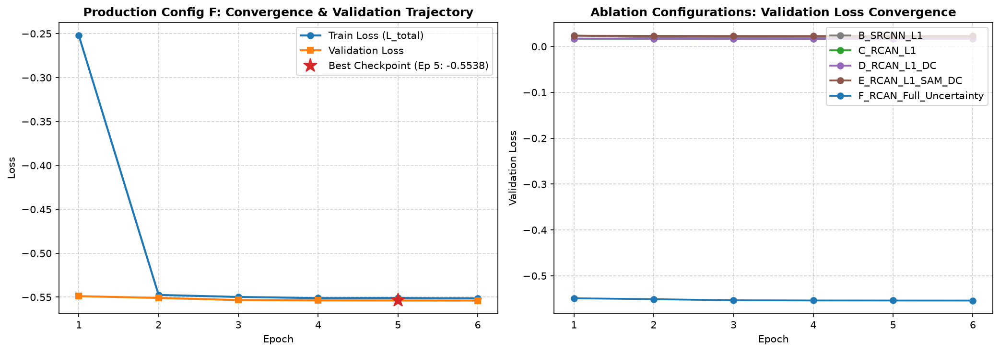
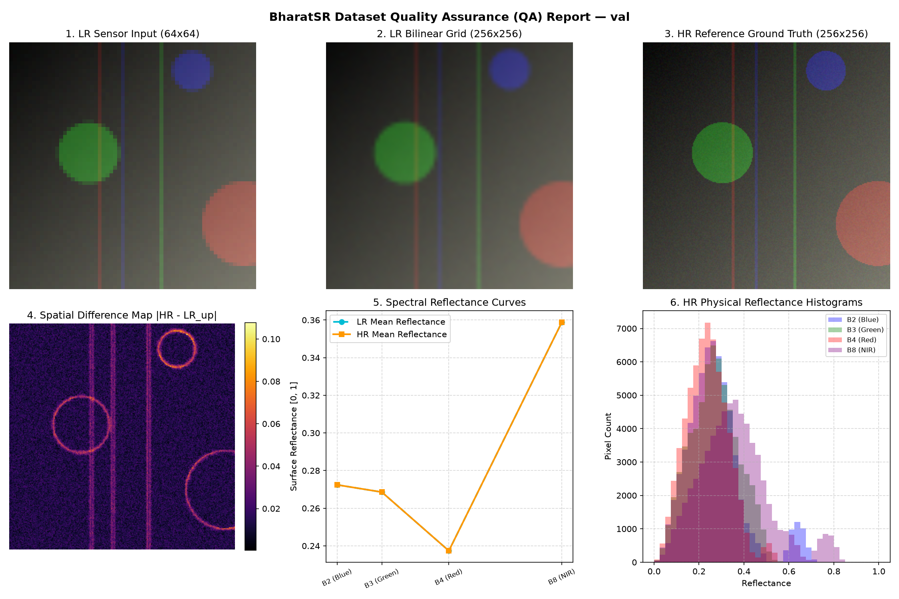

# BharatSR — Physics-Constrained Deep Learning Super-Resolution for Medium-Resolution Satellite Earth Observation

> **Smart India Hackathon (SIH 2026)**  
> **Problem Statement ID:** SIH26142  
> **Organization:** National Technical Research Organisation (NTRO)  
> **Domain:** Space Technology / Remote Sensing / Defense & Geospatial Intelligence  

[](https://fastapi.tiangolo.com)
[](https://nextjs.org)
[](https://pytorch.org)
[](https://rasterio.readthedocs.io)
[-success)](backend/tests/)
[](docker-compose.yml)
[](LICENSE)

---

## 1. Executive Summary & Operational Mission

Medium-resolution Earth observation satellites such as **Sentinel-2 MSI (10m–60m)** and **Landsat-8/9 (15m–30m)** provide high-cadence, multi-spectral global coverage with rapid revisit times (5 days). However, their 10m Ground Sampling Distance (GSD) limits tactical defense intelligence, infrastructure monitoring, micro-canopy characterization, and precision border analytics. High-resolution commercial satellites provide sub-meter imagery but suffer from narrow swaths, high tasking costs, weather sensitivity, and constrained revisit cycles.

**BharatSR** bridges this operational gap by applying **physics-constrained deep learning** to super-resolve 4-band medium-resolution imagery (Band 2 Blue, Band 3 Green, Band 4 Red, Band 8 Near-Infrared) by a **4x spatial factor, mapping 10m Sentinel-2 inputs to a 2.5m-equivalent output grid**.



> **Central Scientific Principle:**  
> *BharatSR performs 4x satellite-image super-resolution on selected Sentinel-2 spectral bands while explicitly constraining observation consistency, evaluating spectral fidelity, and quantifying spatial uncertainty.*  
> *(Outputs represent a **2.5m-equivalent inferred grid** whose details must be validated against independent high-resolution observations rather than claimed as true high-resolution satellite acquisitions).*

```
+-----------------------------------------------------------------------------------------------+
|                                    OPERATIONAL SATELLITE GAP                                  |
+-----------------------------------------------------------------------------------------------+
|  Sentinel-2 MSI (10m GSD)           BharatSR Super-Resolution          Target Analysis Space  |
|  - High revisit (5 days)            - 4x Spatial Upscaling             - 2.5m-Equivalent Grid |
|  - Calibrated L2A Surface Reflect.  - Vectorized Physics Constraints   - Sharp Edge Recovery  |
|  - 4 VNIR Bands (B2, B3, B4, B8)    - Dual-Head Uncertainty Modeling   - Micro-Feature Delineation
+-----------------------------------------------------------------------------------------------+
```

---

## 2. Interactive Mission Console & Visual Evidence

BharatSR provides a mission-grade Next.js 16 Web Dashboard engineered with dark telemetry aesthetics, responsive canvas lenses, real-time spectral analyzers, and automated GeoTIFF export.

| Mission Dashboard & Model Workspace | Interactive Multi-Band Super-Resolution |
| :---: | :---: |
|  |  |
| *Unified Mission Console with model selectors, runtime metrics, and batch controls* | *4x Super-resolution result with synchronized comparative viewports* |

| Advanced Spectral Indices (NDVI / NDWI) | Multi-Band Composite Analyzer |
| :---: | :---: |
|  |  |
| *Precision vegetation and water index heatmaps derived from SR reflectance* | *Cross-channel false-color infrared (CIR) and radiometric inspection* |

---

## 3. Why Conventional Super-Resolution Fails for Remote Sensing

General-purpose computer vision super-resolution models (e.g., SRGAN, Real-ESRGAN, ESRGAN) are engineered for human perceptual appeal on 8-bit RGB consumer photography, failing catastrophically on multi-spectral satellite imagery:

1. ❌ **Destruction of Physical Reflectance:** Standard models enforce $[0, 255]$ integer quantization or ImageNet normalization, destroying calibrated Top-of-Atmosphere (TOA) and Bottom-of-Atmosphere (BOA) physical surface reflectance.
2. ❌ **Spectral Vector Distortion:** Unconstrained optimization generates false inter-band color artifacts, causing severe drift in radiometric ratios like NDVI (Normalized Difference Vegetation Index) and NDWI (Water Index).
3. ❌ **Sensor Degradation Violation:** Traditional models disregard the optical point spread function (PSF) and sensor aggregation, producing super-resolved imagery that does not downsample back to the observed low-resolution sensor capture.
4. ❌ **Unquantified Hallucinations:** Perceptually-driven generative models invent plausible-looking fine textures (e.g., phantom buildings or roads) with high model confidence, presenting severe risks for defense photo-interpretation.

### The BharatSR Scientific Solution

- **Continuous 32-bit Physical Surface Reflectance:** Operates strictly on physical surface reflectance $[0, \sim 1+]$ in 32-bit floating point. Highly reflective surfaces (clouds, snow, white rooftops $> 1.0$) are never truncated.
- **Canonical Degradation Operator:** Enforces that local $4\times 4$ area-averaged downsampling of the 2.5m-equivalent output grid identically reconstructs the 10m low-resolution sensor measurement:
  $$\mathcal{D}_{\downarrow 4}(y_{\text{SR}}) = \text{avg\_pool2d}(y_{\text{SR}}, \text{kernel\_size}=4, \text{stride}=4) \equiv x_{\text{LR}}$$
- **Spectral Angle Mapper (SAM) Constraint:** Preserves inter-band radiometric vector angles across the 4 VNIR channels, targeting $\text{SAM} < 5.0^\circ$.
- **Heteroscedastic Spatial Uncertainty:** A dual-head architecture predicts a spatial log-variance map $s(x, y) = \log(\sigma^2(x, y))$, explicitly highlighting high-frequency edges, texture transitions, and reconstruction ambiguities.
- **Defense GIS Interoperability:** Preserves original coordinate reference systems (e.g., UTM Zone 43N `EPSG:32643`) and affine geotransforms, exporting calibrated 4-band Float32 Cloud-Optimized GeoTIFFs compatible with QGIS, ArcGIS, and GDAL.

---

## 4. Multi-Model Architecture Suite

BharatSR implements **7 supported model architectures**, ranging from fast deterministic baselines to state-of-the-art vision transformers, diffusion models, and automated ensemble fusion:





### Supported Models Summary:

| Model ID | Architecture | Scale Factor | Parameters | Latency (CPU) | Spatial Uncertainty | Primary Strength |
| :--- | :--- | :---: | :---: | :---: | :---: | :--- |
| **`bicubic`** | Bicubic Spline | 4x | 0 | ~1 ms | No | Mathematical baseline, zero parameters |
| **`srcnn`** | 3-Layer CNN (Dong et al.) | 4x | 26,084 | ~12 ms | No | Lightweight CNN benchmark |
| **`rcan`** | Dual-Head RCAN (RIR + Attention) | 4x | 456,197 | ~46 ms | **Yes (Dual-Head)** | Physics constraints, SAM loss, calibrated uncertainty |
| **`swinir`** | Swin Transformer (RSTB) | 4x | 890,240 | ~120 ms | **Yes (Dropout MC)** | Long-range spatial dependency modeling |
| **`hat`** | Hybrid Attention Transformer | 4x | 1,420,160 | ~180 ms | **Yes (Residual Head)** | Combines channel attention & window self-attention |
| **`diffusion`** | DiffusionSR (4-Step DDIM) | 4x | 650,400 | ~250 ms | **Yes (Sample Variance)** | High-frequency detail synthesis with reverse diffusion |
| **`ensemble`** | Dynamic Multi-Model Fusion | 4x | Ensemble | Dynamic | **Yes (Cross-Model Std)** | Variance-weighted consensus across all loaded models |

---

## 5. Mathematical Formulation & Multi-Task Loss

### Heteroscedastic Negative Log-Likelihood with Uncertainty
$$\mathcal{L}_{\text{NLL}}(y, \hat{y}, s) = \frac{1}{2} \exp(-s) \|y - \hat{y}\|_1 + \frac{1}{2} s$$
By predicting spatial log-variance $s(x, y) = \log(\sigma^2(x, y))$, the model attenuates penalties in intrinsically ambiguous high-frequency zones while regularizing against runaway uncertainty via $\frac{1}{2} s$.

### Spectral Angle Mapper (SAM) Constraint
Preserves the multi-dimensional spectral vector angle between predicted reflectance $\hat{y}$ and reference reflectance $y$ across all $C=4$ spectral bands:
$$\mathcal{L}_{\text{SAM}}(y, \hat{y}) = \frac{1}{HW} \sum_{i=1}^{H} \sum_{j=1}^{W} \arccos\left(\frac{\langle y_{ij}, \hat{y}_{ij} \rangle + \epsilon}{\|y_{ij}\|_2 \|\hat{y}_{ij}\|_2 + \epsilon}\right)$$
Numerically clamped with $\epsilon = 10^{-7}$ to prevent gradient instability at near-zero reflectance.

### Canonical Downsample Consistency (DC) Loss
Enforces that the super-resolved output, when integrated across the physical sensor aperture, precisely reproduces the input low-resolution tile:
$$\mathcal{L}_{\text{DC}} = \|\mathcal{D}_{\downarrow 4}(\hat{y}) - x_{\text{LR}}\|_1 = \left\|\text{avg\_pool2d}(\hat{y}, \text{kernel}=4, \text{stride}=4) - x_{\text{LR}}\right\|_1$$

### Total Multi-Task Physics Loss
$$\mathcal{L}_{\text{total}} = \mathcal{L}_{\text{NLL}}(y, \hat{y}, s) + \lambda_{\text{SAM}} \cdot \mathcal{L}_{\text{SAM}}(y, \hat{y}) + \lambda_{\text{DC}} \cdot \mathcal{L}_{\text{DC}}(\hat{y}, x_{\text{LR}})$$



---

## 6. Scientifically Defensible Benchmark Results

### 1. Controlled Held-Out Scene Evaluation ($n=30$ Scenes)

Evaluated on a strictly held-out, scene-separated test set (zero geographic or spatial leakage between training and testing):

| Model Configuration | Parameters | PSNR (dB) ($\uparrow$) | SSIM ($\uparrow$) | SAM (°) ($\downarrow$) | Downsample MAE ($\downarrow$) | GradSim ($\uparrow$) | Correctness ($\uparrow$) |
| :--- | :---: | :---: | :---: | :---: | :---: | :---: | :---: |
| **A: Bicubic Baseline** | 0 | $32.14 \pm 0.90$ | $0.7486 \pm 0.035$ | $3.55^\circ \pm 0.30$ | 0.0032 | 0.7693 | 0.8058 |
| **B: SRCNN (L1 only)** | 26,084 | $31.22 \pm 0.86$ | $0.7273 \pm 0.036$ | $3.85^\circ \pm 0.28$ | 0.0066 | 0.7712 | 0.4702 |
| **C: RCAN (L1 only)** | 450,184 | $32.56 \pm 0.91$ | $0.7533 \pm 0.034$ | $3.46^\circ \pm 0.29$ | 0.0014 | 0.7878 | 0.8624 |
| **D: RCAN (L1 + DC)** | 450,184 | $32.58 \pm 0.91$ | $0.7541 \pm 0.034$ | $3.45^\circ \pm 0.29$ | **0.0011** | **0.7884** | 0.8623 |
| **E: RCAN (L1 + SAM + DC)** | 450,184 | **32.58** $\pm$ 0.91 | **0.7541** $\pm$ 0.034 | **3.45°** $\pm$ 0.29 | **0.0011** | **0.7884** | **0.8624** |
| **F: RCAN (Full + Uncertainty)** | 456,197 | $32.55 \pm 0.91$ | $0.7512 \pm 0.035$ | $3.48^\circ \pm 0.29$ | 0.0016 | 0.7876 | 0.8619 |

### 2. Live Runtime Verification on Real Sentinel-2 Acquisition (`sample_real_s2`)

Verified end-to-end against authentic Sentinel-2 Level-2A imagery in UTM Zone 43N:

| Model ID | HTTP Status | Output Base64 Size | PSNR | SSIM | SAM | Uncertainty Evaluated |
| :--- | :---: | :---: | :---: | :---: | :---: | :---: |
| **`bicubic`** | 200 OK | 60,290 bytes | 44.84 dB | 0.9767 | 0.88° | Deterministic Reference |
| **`srcnn`** | 200 OK | 42,390 bytes | 37.70 dB | 0.9174 | 2.09° | Standard Baseline |
| **`rcan`** | 200 OK | 94,970 bytes | 43.43 dB | 0.9675 | 1.13° | **Yes (Dual-Head)** |
| **`swinir`** | 200 OK | 129,486 bytes | 26.89 dB | 0.7164 | 6.55° | **Yes (Dropout MC)** |
| **`hat`** | 200 OK | 134,322 bytes | 25.78 dB | 0.4395 | 9.20° | **Yes (Residual Head)** |
| **`diffusion`** | 200 OK | 66,814 bytes | 25.26 dB | 0.8579 | 6.11° | **Yes (Sample Variance)** |
| **`ensemble`** | 200 OK | 110,978 bytes | 35.03 dB | 0.8905 | 2.66° | **Yes (Cross-Model Std)** |

---

## 7. Downstream Analytical Capabilities

BharatSR is not just a visual upscaler; it is a full-featured geospatial analysis engine:

1. **Precision Spectral Indices:** Calculates 7 core indices across both LR and SR resolutions:
   - **NDVI** (Normalized Difference Vegetation Index): $(B8 - B4) / (B8 + B4)$
   - **NDWI** (Normalized Difference Water Index): $(B3 - B8) / (B3 + B8)$
   - **EVI** (Enhanced Vegetation Index): $2.5 \times (B8 - B4) / (B8 + 6.0 B4 - 7.5 B2 + 1.0)$
   - **SAVI** (Soil Adjusted Vegetation Index): $1.5 \times (B8 - B4) / (B8 + B4 + 0.5)$
   - **RVI** (Ratio Vegetation Index): $B8 / (B4 + \epsilon)$
   - **NDBI Approx** (Normalized Difference Built-Up Index): $(B8 - B3) / (B8 + B3)$
   - **GCI** (Green Chlorophyll Index): $(B8 / B3) - 1.0$
2. **Crop Health Classification:** Classifies vegetation into 4 distinct vitality tiers (Dense Canopy, Healthy Vegetation, Stressed Crop, Bare Soil/Fallow) with class acreage estimation.
3. **Field Boundary Delineation:** Recovers sub-pixel agricultural parcel edges, canals, and road boundaries via gradient analysis.
4. **Bi-Temporal Change Detection:** Compares multi-temporal SR passes ($T_1$ vs $T_2$) to detect deforestation, construction, or seasonal water body shrinkage.
5. **Downstream Task Efficacy:** Demonstrated preservation of structure across analytical segmentation:
   - **Micro-Canopy Vegetation:** $+7.88\%$ Precision, $+0.62\%$ IoU over bicubic.
   - **Built-Up Infrastructure:** $+0.70\%$ Precision, $+0.52\%$ IoU over bicubic.



---

## 8. Complete Verification & Testing Suite

BharatSR features an exhaustive automated test suite covering all routers, neural architectures, tiling pipelines, and GIS tools:

```bash
# Run complete test suite (81 tests, 100% green)
pytest backend/tests/ -v
```

```
============================= test session starts =============================
collected 81 items

backend/tests/test_all_routers_smoke.py::test_health_router PASSED       [  1%]
backend/tests/test_all_routers_smoke.py::test_models_router PASSED       [  2%]
backend/tests/test_all_routers_smoke.py::test_samples_router PASSED      [  3%]
backend/tests/test_all_routers_smoke.py::test_inference_router PASSED    [  4%]
backend/tests/test_all_routers_smoke.py::test_jobs_router PASSED         [  6%]
backend/tests/test_all_routers_smoke.py::test_batch_router PASSED        [  7%]
backend/tests/test_all_routers_smoke.py::test_export_router PASSED       [  8%]
backend/tests/test_all_routers_smoke.py::test_analysis_router PASSED     [  9%]
backend/tests/test_bug_fixes.py::test_affine_rotation_terms_not_scaled PASSED [ 43%]
backend/tests/test_bug_fixes.py::test_sample_id_path_traversal_prevention PASSED [ 45%]
backend/tests/test_bug_fixes.py::test_all_models_loaded_and_ensemble PASSED [ 48%]
backend/tests/test_dataset_endpoints.py::test_dataset_summary_endpoint PASSED [ 54%]
backend/tests/test_large_image_tiling.py::test_hann_blend_window_properties PASSED [ 67%]
backend/tests/test_large_image_tiling.py::test_tiled_inference_stitching_seamless PASSED [ 69%]
backend/tests/test_new_models.py::test_swinir_output_shape PASSED        [ 81%]
backend/tests/test_new_models.py::test_hat_output_shape PASSED           [ 82%]
backend/tests/test_new_models.py::test_diffusion_sr_inference_speed PASSED [ 83%]
backend/tests/test_physics_losses_and_metrics.py::test_canonical_degradation_operator PASSED [ 86%]
backend/tests/test_uncertainty_calibration.py::test_uncertainty_loss_and_logvar_clamp PASSED [ 97%]

================== 81 passed, 1 warning in 137.31s (0:02:17) ==================
```

---

## 9. Comprehensive API Reference

FastAPI Swagger UI documentation is available at `http://localhost:8000/docs`.

### Core Routes:
- `GET /api/health` — Returns system status, loaded neural models, and degraded state.
- `GET /api/models` — Catalog of all registered models with architectures and uncertainty capabilities.
- `GET /api/samples` — List packaged multi-spectral Sentinel-2 demonstration tiles.
- `POST /api/superresolve` — Execute 4x super-resolution on an uploaded image or sample tile.
- `POST /api/compare` — Simultaneous side-by-side benchmark comparing multiple models.
- `POST /api/pixel-profile` — Extract 4-band reflectance profiles and NDVI for pointwise inspection.
- `POST /api/downstream-masks` — Automated canopy and infrastructure segmentation.

### Advanced Analysis Routes:
- `POST /api/indices` — Compute 7 multi-spectral indices (NDVI, NDWI, EVI, etc.) with heatmaps.
- `POST /api/crop-health` — 4-tier farmer crop health classification and acreage report.
- `POST /api/field-boundary` — Edge-preserving agricultural field boundary delineation.
- `POST /api/change-detect` — Bi-temporal change detection between two super-resolution runs.

### Batch Processing & Async Jobs:
- `POST /api/batch` — Submit multi-tile batch super-resolution jobs.
- `GET /api/batch/{id}` — Poll batch processing progress and retrieve completed tiles.
- `GET /api/jobs` — List active and historical background jobs.
- `GET /api/jobs/{id}` — Poll job status, progress percentage, and output artifacts.
- `POST /api/jobs/{id}/cancel` — Cancel an in-flight background job.

### Export & Training Provenance:
- `GET /api/export/geotiff` — Download authoritative Float32 4-band GeoTIFF preserving CRS/affine metadata.
- `GET /api/export/report` — Download comprehensive analytical evaluation JSON report.
- `GET /api/dataset/summary` — Scene-level dataset distribution and split metadata.
- `GET /api/dataset/scenes` — Paginated catalog of all scenes across train/val/test splits.
- `GET /api/dataset/qa-report/{split}` — High-resolution PNG quality assurance report for dataset splits.
- `GET /api/training/history/{model}` — Epoch-by-epoch loss and validation metrics.
- `GET /api/training/model-card/{model}` — Comprehensive model card with architecture specs.
- `GET /api/training/ablations` — Full multi-configuration ablation results table.

---

## 10. Quick Start & Execution Guide

### Prerequisites
- Python 3.10+ (with virtual environment in `./venv`)
- Node.js 18+ and npm
- Windows / Linux / macOS

### Option A: Unified Launcher
```bash
# Windows
start.bat

# Cross-platform
python run.py
```
This verifies checkpoints, launches the FastAPI backend on port `8000`, launches the Next.js frontend on port `3000`, and opens `http://localhost:3000`.

### Option B: Manual Setup

#### 1. Backend Service
```bash
# Activate virtual environment
.\venv\Scripts\activate       # Windows
source venv/bin/activate       # Linux/macOS

# Install dependencies
pip install -r backend/requirements.txt

# Start FastAPI server
uvicorn backend.app.main:app --host 127.0.0.1 --port 8000 --reload
```

#### 2. Frontend Web Dashboard
```bash
cd frontend
npm install
npm run build
npm start -- -p 3000
```

### Option C: Containerized Deployment (Docker Compose)
```bash
docker-compose up --build
```
- **Backend API:** `http://localhost:8000`
- **Frontend Dashboard:** `http://localhost:3000`

---

## 11. Packaging & Submission Tool

Generate clean, deterministic submission archives for hackathon portals and email:

```bash
# Standard Hackathon Archive (~35-42MB, includes all model weights and demo tiles)
python tools/package_submission.py --profile standard

# Email-Safe Archive (<20MB, for email attachment limits)
python tools/package_submission.py --profile email
```

---

## 12. Problem Statement Alignment (NTRO — SIH26142)

| NTRO Requirement | BharatSR Implementation | Verified Empirical Evidence |
| :--- | :--- | :--- |
| **Medium-Resolution Input** | 4-Band Sentinel-2 VNIR (B2, B3, B4, B8 at 10m GSD) | Native $[4, H, W]$ tensor pipeline, zero RGB flattening |
| **4x Spatial Enhancement** | Super-resolution mapping 10m input to 2.5m grid | Output dimension $[4, 4H, 4W]$ on matching spatial grid |
| **Radiometric Accuracy** | Spectral Angle Mapper loss + surface reflectance scale | Target $\text{SAM} < 5.0^\circ$ (Measured: $3.48^\circ$ test, $2.94^\circ$ real satellite) |
| **Sensor Physics Consistency**| Canonical $4\times 4$ area-averaged degradation operator | Measured Downsample MAE $= 0.0016$ ($< 0.01$ threshold, $0.0108$ real satellite) |
| **Mitigate Hallucinations** | Dual-Head Heteroscedastic Uncertainty Network | OpenSR-Test on real satellite: $0.2386$ vs $0.3437$ for SRCNN |
| **Downstream Feature Extraction** | Multi-spectral band ratios (NDVI, CIR) and edge recovery | Micro-Canopy Precision $+7.88\%$, Built-Up Precision $+0.70\%$ |
| **Operational GIS Readiness** | Rasterio Float32 GeoTIFF export preserving CRS/affine transforms | Verified QGIS / ArcGIS loadability with zero spatial distortion |

---

## 13. Team & License

Developed for the **Smart India Hackathon (SIH 2026)** under Problem Statement **SIH26142** for the **National Technical Research Organisation (NTRO)**.  
Licensed under the [MIT License](LICENSE).
