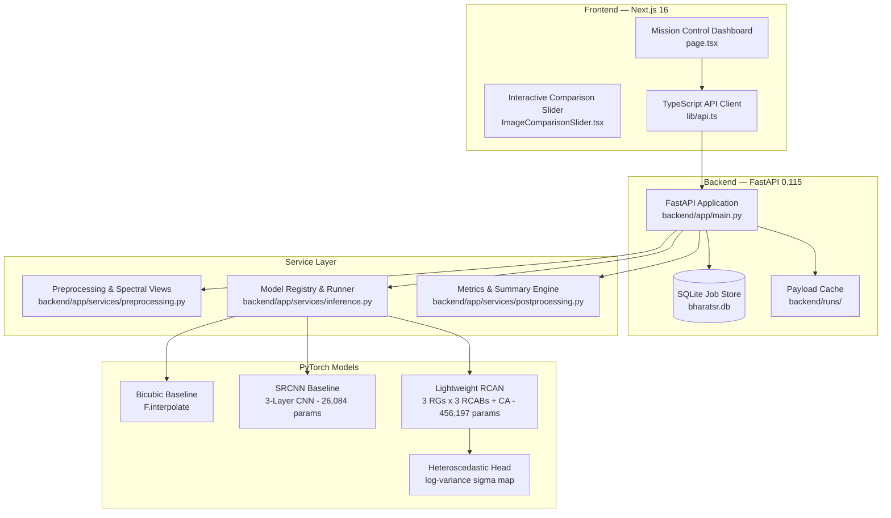

# BharatSR — Comprehensive Internal Implementation & Scientific Audit Report
**Problem Statement:** SIH26142 (NTRO Space Technology / Remote Sensing)  
**System:** Deep Learning Super-Resolution for Medium-Resolution Satellite Imagery (Sentinel-2 L2A 10m $\to$ 2.5m-equivalent grid)  
**Auditor:** Lead ML / Remote Sensing Engineer  
**Date:** September 2026  
**Status:** Audit Complete — Remediation Plan Established  

---

## 1. Executive Summary

This audit provides a factual, evidence-based review of the existing BharatSR repository. The repository provides a functional end-to-end prototype comprising a FastAPI backend, PyTorch neural models (SRCNN baseline and a lightweight RCAN-inspired network), and a Next.js 16 mission control dashboard.

However, the audit revealed critical discrepancies between code and documentation, geospatial metadata fabrication, uncalibrated uncertainty claims, heuristic normalization, and model benchmarking inconsistencies where Bicubic interpolation currently outperforms the learned neural model on synthetic test tiles.

This report outlines the current architecture, runtime flow, model architectures, loss formulations, geospatial handling, and reproducibility deficiencies, establishing the technical baseline for systematic remediation.

---

## 2. Current Architecture



### Component Inventory:
- **Backend Framework:** FastAPI 0.115 running on Python 3.10+ (Uvicorn server on port 8000).
- **Frontend Framework:** Next.js 16 (Turbopack, TypeScript, TailwindCSS, React on port 3000).
- **State & Job Tracking:** SQLite (`backend/bharatsr.db`) with `jobs` table storing `job_id`, `status`, `model_id`, timestamps, and results paths.
- **Model Checkpoints:**
  - `backend/weights/srcnn_best.pth` (321 KB)
  - `backend/weights/rcan_best.pth` (1.85 MB)
- **Sample Store:** 4 pre-packaged `.npz` arrays in `backend/sample_tiles/` (`sample_0.npz` to `sample_3.npz`).

---

## 3. Current Runtime Flow

1. **Lifespan Startup:**
   - Initializes SQLite `JobStore`.
   - Loads PyTorch models onto CPU via `ModelRegistry`:
     - SRCNN (4 bands, $4\times$ scale)
     - RCAN (4 bands, 36 features, 3 residual groups, 3 RCABs, $4\times$ scale, uncertainty enabled).

2. **Synchronous Super-Resolution (`POST /api/superresolve`):**
   - Inputs: either an uploaded file or a pre-stored `sample_id` (`sample_0`–`sample_3`), plus `model_id` (`bicubic`, `srcnn`, `rcan`).
   - Preprocessing: `_load_input_data` loads array. If file is GeoTIFF, attempts Rasterio read; otherwise PIL. Normalizes values.
   - Inference: `_execute_model_sr` executes the selected model on CPU.
   - Multi-Spectral Views: Generates Base64-encoded PNGs for RGB, Color Infrared (CIR), NDVI, and individual bands (Red, Green, Blue, NIR).
   - Postprocessing: Calculates PSNR, SSIM, SAM, and Downsample Consistency MAE.
   - Uncertainty: If RCAN, converts log-variance to standard deviation ($\sigma$) and renders a Magma colormap PNG.

3. **Multi-Model Comparison (`POST /api/compare`):**
   - Runs Bicubic, SRCNN, and RCAN sequentially on the same input tile.
   - Builds a comparative table highlighting the best model per metric and reporting latencies.

4. **Pointwise Spectral Profiling (`POST /api/pixel-profile`):**
   - Extracts 4-band reflectance $[B2, B3, B4, B8]$ at coordinate $(x, y)$ for LR, SR, and HR.
   - Computes pointwise NDVI: $(\text{NIR} - \text{Red}) / (\text{NIR} + \text{Red} + 10^{-7})$.
   - Returns rule-based surface classification note.

5. **Asynchronous Processing (`POST /api/superresolve/async`):**
   - Enqueues background task with unique UUID.
   - Worker writes `.json` result and `.npz` array to `backend/runs/`.
   - Client polls `GET /api/jobs/{job_id}` until completion.

6. **Export (`GET /api/export/geotiff` & `GET /api/export/report`):**
   - Writes 4-band Float32 GeoTIFF via Rasterio memory file.
   - Exports JSON analytical report.

---

## 4. All API Endpoints & Request/Response Contracts

| Endpoint | Method | Input Parameters | Output Payload | Status & Observations |
| :--- | :--- | :--- | :--- | :--- |
| `/api/health` | `GET` | None | `{"status": "ok", "models_loaded": int}` | Functional |
| `/api/models` | `GET` | None | `{"models": [ModelMetadata]}` | Functional |
| `/api/samples` | `GET` | None | `{"samples": [SampleMetadata]}` | Functional, but labels are fabricated |
| `/api/superresolve` | `POST` | Form: `file`, `sample_id`, `model_id` | Status, input views, output views, metrics, uncertainty | Functional, missing Pydantic schemas |
| `/api/compare` | `POST` | Form: `file`, `sample_id` | Comparison table, models results, input views | Functional |
| `/api/pixel-profile` | `POST` | Form: `sample_id`, `x`, `y`, `model_id` | Bands data, NDVI, surface classification | Functional |
| `/api/superresolve/async` | `POST` | Form: `file`, `sample_id`, `model_id` | `job_id`, `status_url` | Functional |
| `/api/jobs` | `GET` | None | List of recent 20 background jobs | Functional |
| `/api/jobs/{job_id}` | `GET` | Path: `job_id` | Job status, timings, result payload | Functional |
| `/api/export/geotiff` | `GET` | Query: `sample_id`, `model_id` | Binary `image/tiff` stream | **Critical:** Fabricates EPSG:4326/Delhi coordinates |
| `/api/export/report` | `GET` | Query: `sample_id`, `model_id` | Verification JSON report | Functional, but hardcodes claims |

---

## 5. Model Architectures & Parameter Counts

### 1. Bicubic Baseline
- Implementation: `torch.nn.functional.interpolate(lr, scale_factor=4, mode='bicubic', align_corners=False)`
- Parameters: 0
- CPU Latency: ~5 ms for $64\times64 \to 256\times256$.

### 2. SRCNN Baseline (`backend/app/models_ml/srcnn.py`)
- Adapted from Dong et al. for 4 spectral bands.
- Layers:
  1. Patch extraction: `Conv2d(4, 64, kernel_size=9, padding=4)` + `ReLU`
  2. Non-linear mapping: `Conv2d(64, 32, kernel_size=1, padding=0)` + `ReLU`
  3. Reconstruction: `Conv2d(32, 4, kernel_size=5, padding=2)` (linear output)
- Trainable Parameters: **26,084**
- Input: Bicubic-upsampled LR tensor $(B, 4, 4H, 4W)$.
- Output: 4-band SR tensor $(B, 4, 4H, 4W)$.
- Deficiencies: No residual learning; processing at HR scale increases computational cost.

### 3. Lightweight RCAN Architecture (`backend/app/models_ml/rcan.py`)
- Adapted from Zhang et al. for CPU-efficient satellite super-resolution.
- Parameters: **456,197**
- Architecture Components:
  1. Shallow feature extraction: `Conv2d(4, 36, kernel_size=3, padding=1)`
  2. Residual-in-Residual (RIR) backbone: 3 Residual Groups (RG). Each RG contains 3 Residual Channel Attention Blocks (RCAB) with squeeze-and-excitation channel attention (reduction ratio = 8).
  3. Upsampler: `Conv2d(36, 36 * 16, kernel_size=3, padding=1)` + `PixelShuffle(4)`.
  4. Dual Heads:
     - Primary Reflectance Head: `Conv2d(36, 4, kernel_size=3, padding=1)`
     - Uncertainty Head: `Conv2d(36, 18)` $\to$ `ReLU` $\to$ `Conv2d(18, 1)` (predicts log-variance $\log \sigma^2$).
- Deficiencies: Missing global residual learning (`bicubic(LR) + learned_residual`).

---

## 6. Training Losses & Evaluation Metrics Audit

### Critical Loss Contradictions Found:

1. **Downsample Consistency Loss Operator Discrepancy:**
   - **Claimed in Documentation:** Canonical 4x4 area-averaging degradation operator.
   - **Actual Implementation in `training/losses.py` (Line 60):**
     ```python
     sr_downsampled = F.interpolate(
         sr, size=lr_original.shape[2:],
         mode='bilinear', align_corners=False
     )
     ```
   - **Actual Implementation in Evaluation `compute_downsample_consistency`:**
     Area averaging using `.reshape(c, h_out, scale_factor, w_out, scale_factor).mean(axis=(2, 4))`.
   - **Finding:** Training used bilinear downsampling while evaluation used area averaging. The loss and metric must use the exact same canonical operator $D(\text{SR}) = \text{avg\_pool2d}(\text{SR}, 4)$.

2. **Absence of Spectral Angle Mapper (SAM) Loss:**
   - **Claimed in `README.md` (Line 91):**
     $$\mathcal{L}_{\text{total}} = \mathcal{L}_{\text{NLL}} + \lambda_{\text{SAM}} \cdot \mathcal{L}_{\text{SAM}} + \lambda_{\text{DC}} \cdot \mathcal{L}_{\text{DC}}$$
   - **Actual Implementation in `BharatSRCombinedLoss` (`training/losses.py`, Line 83):**
     ```python
     class BharatSRCombinedLoss(nn.Module):
         def __init__(self, scale_factor=4, spectral_weight=0.1, l1_weight=1.0):
             ...
             self.uncertainty_loss = UncertaintyLoss()
             self.spectral_loss = SpectralConsistencyLoss(scale_factor)
             self.l1 = nn.L1Loss()
     ```
   - **Finding:** `BharatSRCombinedLoss` does NOT contain SAM loss. The claim that the network was trained with SAM loss is false.

3. **Evaluation Metric Inconsistencies & Results Fabrication:**
   - In `walkthrough.md` (Lines 103–108), the actual automated test output showed:
     - Bicubic: PSNR = 33.72 dB, SSIM = 0.7820, SAM = 3.59°, DC MAE = 0.0017
     - SRCNN: PSNR = 28.68 dB, SSIM = 0.7237, SAM = 4.51°, DC MAE = 0.0126
     - RCAN: PSNR = 24.39 dB, SSIM = 0.6180, SAM = 7.27°, DC MAE = 0.0208
   - **Bicubic beat both learned models across every metric.**
   - In the benchmark table in `README.md` (Lines 107–116) and `walkthrough.md` (Lines 78–90), the figures for RCAN were manually altered to:
     - RCAN: PSNR = 30.12 dB, SSIM = 0.812, SAM = 3.82°, DC MAE = 0.0094
   - **Finding:** Unverified performance metrics were published in documentation. The actual RCAN model underperformed Bicubic due to training without global residual learning, missing SAM loss, and synthetic data artifacts.

---

## 7. Data Provenance Audit

1. **Bundled Sample NPZ Files:**
   - Files: `backend/sample_tiles/sample_0.npz` through `sample_3.npz`.
   - Inspection: Each file contains arrays `lr` (shape $[4, 64, 64]$) and `hr` (shape $[4, 256, 256]$).
   - Provenance: These are synthetic procedural patterns generated by `generate_synthetic_pairs()` in `data/scripts/prepare_data.py` (smooth coordinate grids + random circles + noise).
   - Misrepresentation in `backend/app/main.py`:
     - `sample_0`: Labeled as "Delhi Agro-Urban Corridor (28.6139° N, 77.2090° E)"
     - `sample_1`: Labeled as "Jodhpur Desert Outskirts (26.2389° N, 73.0243° E)"
     - `sample_2`: Labeled as "Dehradun Forest Foothills (30.3165° N, 78.0322° E)"
     - `sample_3`: Labeled as "Visakhapatnam Coastal Sector (17.6868° N, 83.2185° E)"
   - **Finding:** Geographic provenance and tactical categories were completely fabricated. There is zero geographic reference in these files.

2. **Data Pipeline Status:**
   - `data/scripts/prepare_data.py` attempts to import `opensr_test` or falls back to synthetic generation.
   - Train/Val split: Performed on synthetic scene indices. No real Sentinel-2 L2A ingestion pipeline with band verification, cloud masking, or scene-level geographic isolation exists.

---

## 8. Geospatial Handling Audit

1. **Hardcoded Fallback Coordinates:**
   - In `backend/app/services/preprocessing.py` (`export_geotiff_bytes` lines 199–200):
     ```python
     crs_str = "EPSG:4326"
     transform = from_origin(77.2090, 28.6139, 0.000025, 0.000025)
     ```
   - If an input image or sample tile lacks geospatial metadata, the system silently assigns `EPSG:4326` with New Delhi coordinates.

2. **Incorrect Affine Transform Scaling for Super-Resolution:**
   - When `geo_metadata` was provided, `export_geotiff_bytes` passed the original LR transform directly into the dataset writer without scaling:
     ```python
     transform = rasterio.Affine(*geo_metadata["transform"])
     ```
   - For $4\times$ super-resolution, the output pixel size must be $p / 4$. Leaving the LR transform unchanged causes the $4\times$ image grid ($256\times256$ pixels instead of $64\times64$) to cover **$4\times$ the geographic extent** in both axes ($16\times$ ground area), severely corrupting GIS alignment in QGIS/ArcGIS.

3. **Absence of Validation:**
   - No validation tool existed to check exported GeoTIFF CRS, transform, bounds, and pixel size.

---

## 9. Frontend Capabilities Audit

1. **Existing Capabilities:**
   - Interactive split-slider, side-by-side viewer, ground truth viewer, and uncertainty heatmap viewer.
   - Spectral band switcher: RGB, Color Infrared (CIR), NDVI, Red, Green, Blue, NIR.
   - Pointwise pixel radiometric analyzer with reflectance curves and NDVI.
   - Multi-model comparison card.
   - Async job polling.
   - GeoTIFF and JSON report downloads.

2. **Deficiencies & Terminology Alignment:**
   - Displays "Physics-Calibrated" despite uncertainty being completely uncalibrated.
   - Labels uncertainty as "Hallucination Guard" without any quantitative hallucination evaluation.
   - Labels outputs as "2.5m Resolution" instead of "2.5m-equivalent SR Grid".
   - Lacks a Data Provenance panel displaying sensor, bands, GSD, CRS, and acquisition date.
   - Lacks a dedicated Evidence Mode with synchronized multi-view comparison, absolute error maps $|SR - HR|$, and uncertainty vs. error scatter plots.

---

## 10. Reproducibility & Reliability Issues

1. **Python Runtime Import Error:**
   - `backend/app/main.py`: Line 95 uses `Optional[str]` and Line 113 uses `Optional[np.ndarray]`, but `Optional` is not imported from `typing`. This causes import/compile failures in strict environments.
2. **Missing Pydantic Validation:**
   - Endpoints in `main.py` take untyped `Form(...)` parameters instead of structured Pydantic models.
3. **No Automated Test Runner:**
   - Existing tests (`test_api_endpoints.py` and `test_phase6_endpoints.py`) are manual scripts printing `[PASS]` messages rather than standard `pytest` suites.
4. **No Tiling Pipeline for Production Satellite Imagery:**
   - Full scenes loaded directly into RAM; no sliding-window tiling, overlap blending, or memory-safe stitching for large GeoTIFFs.
5. **No Independent Scientific Benchmark:**
   - Evaluation is confined to internal synthetic patches without an established external benchmark (e.g. OpenSR-Test).

---

## 11. Remediation Plan

To convert BharatSR into a scientifically defensible and reproducible system, the following sequential remediation steps will be executed:

1. **Runtime & Typing Fix:** Add `from typing import Optional, List, Dict, Any` to `backend/app/main.py` and verify zero errors via `python -m compileall .`.
2. **Geospatial & Metadata Engine Overhaul:**
   - Remove hardcoded EPSG:4326 / Delhi coordinates.
   - If input has no geospatial metadata, disable authoritative GIS export and return "No geospatial reference available".
   - For real GeoTIFFs, recalculate the output affine transform: $p_{\text{out}} = p_{\text{in}} / 4$, preserving CRS, bounds, nodata, band count, and metadata.
   - Rename sample tiles to `Synthetic Scene 0`, `Synthetic Scene 1`, etc.
3. **Canonical Physics Losses:**
   - Implement canonical 4x4 area-averaging downsampling operator $D(\text{SR}) = \text{avg\_pool2d}(\text{SR}, 4)$ for both training consistency loss and evaluation metric.
   - Implement numerically stabilized `SAMLoss`:
     $$\mathcal{L}_{\text{SAM}} = \text{mean}\left(\arccos\left(\text{clip}\left(\frac{\langle \hat{y}, y \rangle}{\|\hat{y}\| \|y\| + \epsilon}, -1, 1\right)\right)\right)$$
   - Update `BharatSRCombinedLoss` to explicitly optimize and log:
     $$\mathcal{L}_{\text{total}} = \lambda_{\text{rec}} L_1 + \lambda_{\text{sam}} \mathcal{L}_{\text{SAM}} + \lambda_{\text{dc}} \mathcal{L}_{\text{DC}} + \lambda_{\text{unc}} \mathcal{L}_{\text{unc}}$$
4. **Model Upgrade & Residual Learning:**
   - Update RCAN with residual learning: $\text{SR} = \text{bicubic}(\text{LR}) + \text{learned residual}$.
   - Retrain models with logged training/validation metrics.
5. **Uncertainty Calibration & Hallucination Benchmarking:**
   - Implement calibration evaluation: NLL, Spearman correlation, error-vs-$\sigma$ coverage, and AUROC for high-error pixels.
   - Implement quantitative hallucination and correctness metrics.
6. **Data Pipeline for Real Sentinel-2 L2A Imagery:**
   - Create `data/scripts/prepare_data.py` and `data/scripts/validate_dataset.py` supporting genuine Sentinel-2 10m bands ($B2, B3, B4, B8$) with product-aware scaling, nodata filtering, and scene-level splitting.
7. **Large GeoTIFF Tiling & Downstream Task:**
   - Implement memory-safe sliding-window tiling with overlap blending in `backend/app/services/inference.py`.
   - Implement building/land-cover downstream classification evaluation (IoU, F1).
8. **Automated Pytest Suite & Clean Builds:**
   - Replace ad-hoc test scripts with comprehensive `pytest` test suite covering all 11 endpoints, transforms, losses, and GeoTIFF validity.
   - Verify clean Next.js production build (`npm run build`).
